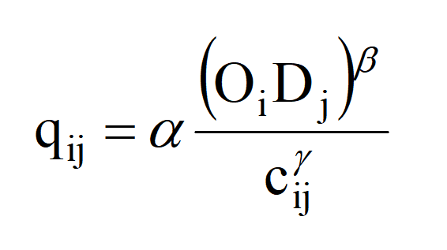

# 基于无约束重力模型和平均增长系数法的交通分布实现

## 1.项目介绍

本项目可以将交通生成阶段预测获得的各校区的发生与吸引量转化为各小区之间的OD分布矩阵。使用了多元回归的方式对对数化的无约束重力模型参数进行标定，而后使用该无约束重力模型进行交通分布预测。当无约束重力模型预测的交通分布无法满足收敛标准时，转用平均增长系数法迭代计算。

## 2.示例
下面是在给定数据上的计算示例
- 交通现状OD分布矩阵
 
| O\D | 1 | 2 | 3 | 4 | 5 |
|-|-|-|-|-|-|
| 1 | 1000 | 500 | 300 | 200 | 100 |
| 2 | 450 | 1500 | 500 | 100 | 150 |
| 3 | 350 | 200 | 800 | 300 | 50 |
| 4 | 150 | 150 | 300 | 700 | 50 |
| 5 | 80 | 100 | 50 | 70 | 500 |

- 交通现状时间代价矩阵
 
| O\D | 1 | 2 | 3 | 4 | 5 |
|-|-|-|-|-|-|
| 1 | 5 | 10 | 18 | 20 | 30 |
| 2 | 12 | 4 | 10 | 25 | 20 |
| 3 | 15 | 10 | 8 | 15 | 35 |
| 4 | 20 | 25 | 15 | 10 | 30 |
| 5 | 35 | 25 | 35 | 35 | 12 |

- 交通未来OD总量

| ΣO | 5000 | 4000 | 3000 | 2500 | 2000 |
|-|-|-|-|-|-|
| ΣD | 4000 | 4500 | 3500 | 2500 | 2000 |

- 交通未来时间代价矩阵

| O\D | 1 | 2 | 3 | 4 | 5 |
|-|-|-|-|-|-|
| 1 | 5 | 10 | 12 | 15 | 20 |
| 2 | 10 | 4 | 8 | 20 | 20 |
| 3 | 10 | 10 | 7 | 10 | 30 |
| 4 | 15 | 20 | 10 | 8 | 20 |
| 5 | 30 | 20 | 30 | 30 | 10 |

采用的无约束重力模型形式如下

对无约束重力模型对数化后，使用交通现状OD矩阵和现状时间代价矩阵的数据对其进行多元线性回归，用于标定无约束重力模型的参数。结果为α=1.0995，β=0.5639，γ=1.1327。

将参数代入后对未来交通OD分布进行迭代预测，满足收敛标准ε<0.003时停止。最终得到结果如下
- 交通未来OD分布矩阵

| O\D | 1 | 2 | 3 | 4 | 5 |
|-|-|-|-|-|-|
| 1 | 2106 | 1067 | 799 | 583 | 433 |
| 2 | 629 | 1969 | 834 | 282 | 296 |
| 3 | 612 | 679 | 941 | 595 | 178 |
| 4 | 411 | 330 | 665 | 803 | 291 |
| 5 | 253 | 445 | 256 | 234 | 807 |

## 3.环境配置
- 输入下面命令完成环境配置
```bash
conda create -n traffic_distrubution python=3.8
pip install -r requirements.txt
```

## 3.使用方法
将准备好的交通现状OD分布矩阵、交通现状时间代价矩阵、交通未来OD总量、交通未来时间代价矩阵数据填入.csv格式文件中，表格不需要输入行列的标题。数据文件放置于data目录下。
- 输入下面的命令开始迭代计算
```bash
python main.py --current_od_path <your current OD path> --future_od_path <your future OD path> --current_time_path <your current time path> --future_time_path <your future time path>
```

### 4.作者
[Ica_l](desprado233@163.com)
